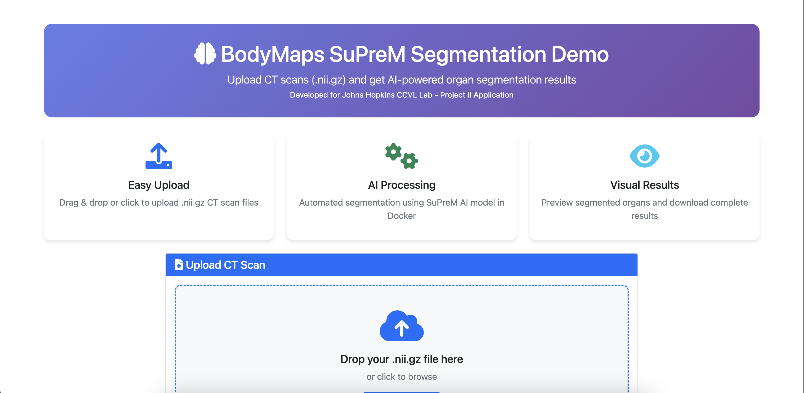
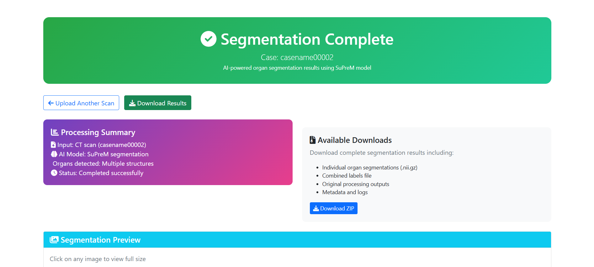
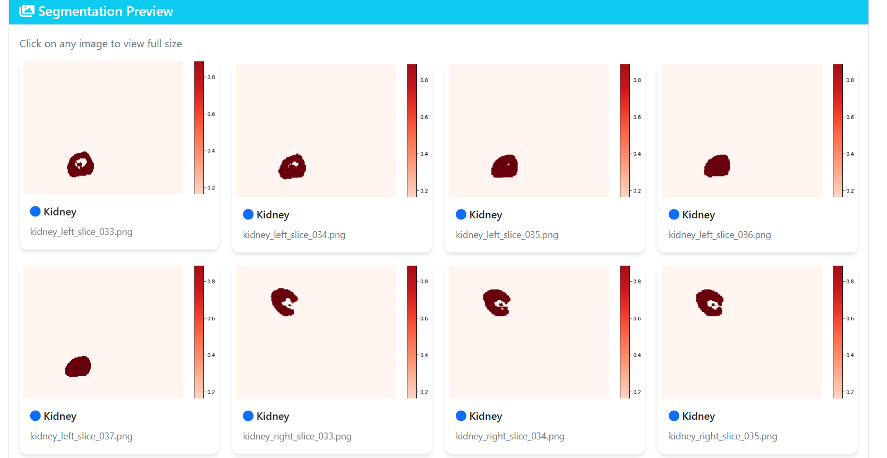

# BodyMaps SuPreM Segmentation Demo

A web-based application for AI-powered medical image segmentation using the SuPreM model. This demo allows users to upload CT scans in NIfTI format (.nii.gz) and receive automated organ segmentation results.

**Developed for Johns Hopkins CCVL Lab - Project II Application**







## 🚀 Features

- **Easy Upload**: Drag & drop interface for .nii.gz CT scan files
- **AI Processing**: Automated segmentation using SuPreM AI model in Docker
- **Real-time Status**: Live updates during processing
- **Visual Results**: Preview segmented organs with interactive image viewer
- **Interactive Segmentation**: Real-time organ segmentation with nnInteractive AI
- **Download Results**: Complete segmentation files in ZIP format
- **Responsive Design**: Bootstrap-based UI that works on desktop and mobile

## 🛠 Technology Stack

| Component | Technology | Purpose |
|-----------|------------|---------|
| **Backend** | Flask (Python) | Web server, file handling, Docker integration |
| **Frontend** | React + Bootstrap 5 + JavaScript | Modern SPA user interface |
| **AI Engine** | SuPreM model via Docker | Medical image segmentation |
| **Image Processing** | nibabel + matplotlib | NIfTI file handling and visualization |
| **Storage** | Local filesystem | Temporary file storage |

### 🔄 Frontend Options

This application now supports **two frontend implementations**:

1. **React Frontend** (Recommended) - Modern SPA with React components and interactive segmentation
2. **HTML Frontend** (Legacy) - Original vanilla HTML/CSS/JavaScript

See [REACT_MIGRATION.md](REACT_MIGRATION.md) for detailed migration information.

## 📋 Prerequisites

Before running this application, ensure you have:

1. **Python 3.8+** with pip
2. **Node.js 16+** and npm (for React frontend)
3. **Docker** installed and running
4. **SuPreM Docker image** (qchen99/suprem:v1)

### Installing Docker and SuPreM Model

```bash
# Install Docker (macOS with Homebrew)
brew install docker

# Start Docker Desktop
open -a Docker

# Pull the SuPreM model (this may take some time - ~5GB)
docker pull qchen99/suprem:v1

# Verify the image is available
docker images | grep suprem
```

## 🔧 Setup Instructions

### 1. Clone the Repository

```bash
git clone https://github.com/sshhaawwnn111/BodyMaps-Demo.git
cd BodyMaps-Demo
```

### 2. Create Virtual Environment

```bash
# Create virtual environment
python3 -m venv venv

# Activate virtual environment
# On macOS/Linux:
source venv/bin/activate
# On Windows:
# venv\Scripts\activate
```

### 3. Install Dependencies

```bash
pip install -r requirements.txt
```

### 4. Create Required Directories

```bash
mkdir -p inputs_data outputs_data static/results
```

### 5. Run the Application

#### Option A: Separated Frontend/Backend (Recommended)

```bash
# One-time setup
chmod +x setup_separated.sh
./setup_separated.sh

# Development mode (frontend + backend separately)
./start_dev.sh
# Frontend: http://localhost:3000
# Backend API: http://localhost:5001

# OR Production mode (single server)
./start_prod.sh
# Application: http://localhost:5001
```

#### Option B: Legacy HTML Frontend

```bash
# Move to backend directory and run legacy version
cd backend
python app_legacy.py
# Application: http://localhost:5000
```

## 📁 Project Structure

```
BodyMaps-Demo/
│
├── frontend/                   # React frontend
│   ├── src/
│   │   ├── components/
│   │   │   ├── UploadPage.js  # Main upload interface
│   │   │   └── ResultsPage.js # Results display page
│   │   ├── App.js             # Main React app
│   │   └── index.js           # React entry point
│   ├── public/                # Public assets
│   ├── package.json           # Node.js dependencies
│   └── build/                 # Production build (generated)
│
├── backend/                    # Flask backend API
│   ├── app.py                 # Main Flask application
│   ├── requirements.txt       # Python dependencies
│   ├── utils/                 # Utility functions
│   │   └── nii_to_png.py     # NIfTI to PNG conversion
│   ├── inputs_data/          # Uploaded CT scans
│   ├── outputs_data/         # SuPreM segmentation results
│   └── static/               # Static files and results
│
├── setup_separated.sh         # Setup script for separated structure
├── start_dev.sh              # Development mode (both servers)
├── start_prod.sh             # Production mode (single server)
└── README.md                 # This file
```

## 📄 License

This project is developed for educational and demonstration purposes as part of the Johns Hopkins CCVL Lab application process.

## 📞 Contact

**Developer**: Shawn Wang  
**Purpose**: Johns Hopkins CCVL Lab - Project II Application  
**Date**: July 2025

---

**Note**: This is a prototype demonstration application. For production use, additional security measures, error handling, and performance optimizations would be required.